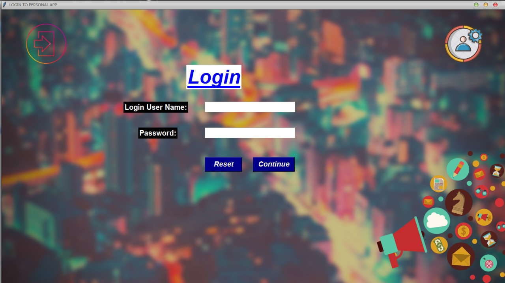

# PersonalApplications
Easy access to the Most Common Applications made by Tkinter 

**Packages Required to Install**

    PIL
    Pygame
  
  
**Need for this Application**

          Minimal Applications which mandatory for the user cannot open 
          at that instance immediately so this application Helps in saving Time and Faster Access

  **This Application Gives You the Fast access to the** 
  
      1)Calculator
      2) MS Word
      3) MS Power point
      4) MS Excel
      5) Sticky Note
      6) Contacts
      7) Music Player
      8) System Cleaner
      9) Chrome

**Features To Be Released Soon**
      1) Reminder
      2) Password Helper
      3) Improving UI to the Existing Application
     
**Images of the Personal Application**

